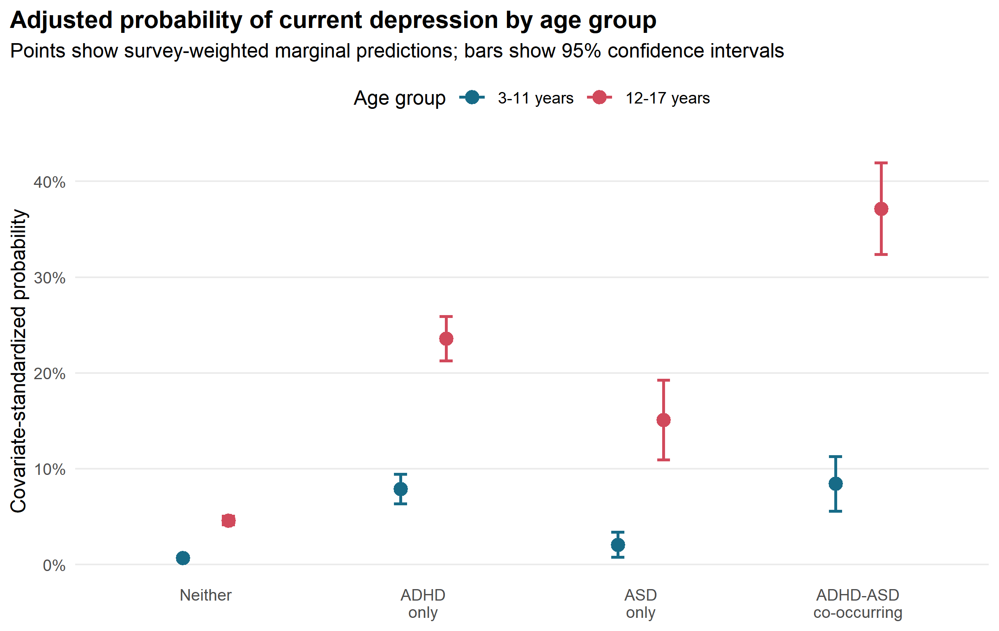

# NSCH ADHD-ASD Depression Analysis

This repository contains the R code used to analyze the association of ADHD, autism spectrum disorder (ASD), their co-occurrence, and current depression among U.S. children and adolescents using the 2023-2024 National Survey of Children's Health (NSCH).

## Core finding



**Figure. Survey-weighted, covariate-standardized probability of current depression by ADHD/ASD group and age group (95% confidence intervals).** The estimated probability of current depression was higher among adolescents aged 12-17 years than among children aged 3-11 years in every group, and the size of this age difference varied by ADHD/ASD group (joint group-by-age interaction p = 0.0013). The co-occurring ADHD-ASD group had the greatest estimated burden: 37.16% (95% CI 32.37%-41.95%) among adolescents, compared with 8.43% (95% CI 5.57%-11.29%) among younger children.

In a separate formal ADHD x ASD model, the product-term interaction OR was 0.460 (95% CI 0.315-0.673), indicating negative departure from multiplicativity. This does not conflict with the co-occurring group having the highest absolute depression probability: absolute burden and multiplicative interaction answer different questions. These cross-sectional, caregiver-reported estimates describe associations and should not be interpreted causally.

## Requirements

- R 4.1 or newer
- R packages: `survey`, `mitools`, `haven`, and `ggplot2`

Install the required packages:

```powershell
Rscript R/00_install_packages.R
```

## Data

The official NSCH public-use files are not included in this repository. Their source URLs and checksums are recorded in `data/raw/download_manifest.csv`.

Download the official files:

```powershell
Rscript R/download_raw_data.R
```

The repository includes `data/example/nsch_example.csv`, a deterministic synthetic dataset for testing the workflow without respondent-level records.

## Run

Run the automated tests:

```powershell
Rscript tests/run_tests.R
```

Run the workflow with the example dataset:

```powershell
Rscript R/run_all.R --mode example
```

Run the workflow with the official files:

```powershell
Rscript R/run_all.R --mode full
```

Generated tables, figures, and session information are written under `outputs/`.

## Structure

- `R/`: data import, survey design, models, contrasts, sensitivity analyses, and figure generation
- `tests/`: unit and end-to-end workflow tests
- `data/example/`: non-identifying example input
- `data/raw/`: official source manifest and download instructions
- `docs/`: variable dictionary and methodology references
